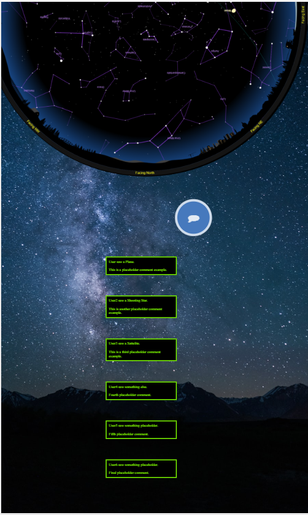

# Star Gazer App

[View the Star Gazer App!](https://nolanhewitt.github.io/stargazer/)
 
*This app is best viewed on a mobile device using chrome

Join our team as we go on an adventure building a Social Astronomy App experience!

### MVP
1. Rotating image of the sky at a specific date and time (scrape using "In the sky" api link)
2. Rotating image of the sky is based off of the users phone magnetic north to base to create the users "line of sight" on the app
3. User Authentication/Login
4. Users can leave comments and the main page will show the most recent comments of all users
5. Users can also view a history of their own comments
6. The comments will use the IBM Watson Tone Analyzer Api to determine the "tone" of the comment and then auto-populate an emoji for each comment.